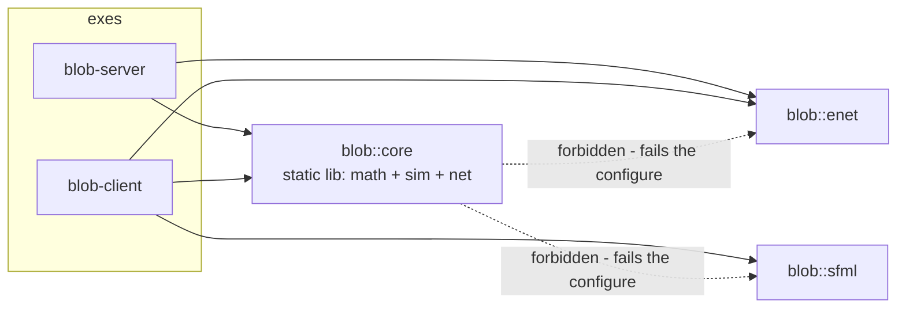
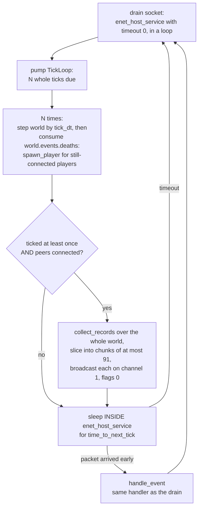

# Architecture

Three build products — a pure simulation/protocol static library, a headless authoritative
server, an SFML client — over a hand-rolled UDP wire format on ENet. This page covers what
each product may depend on, where state lives, the exact shape of both event loops, the
fixed-timestep driver, and the conventions the code is written in.

Companion pages: [data-structures.md](data-structures.md) (every struct, field by field),
[protocol.md](protocol.md) (the wire, byte by byte),
[simulation-math.md](simulation-math.md) (the formulas, derived).

## The three build products

| Target | Product | Links | May know about |
|---|---|---|---|
| `blob_core` (alias `blob::core`) | static lib | nothing external | simulation + wire *format* only — no ENet, no SFML, no sockets, no filesystem, no clocks, no stdout |
| `blob_server` | `blob-server` exe | `blob::core` + `blob::enet` | the transport; must run on a box with no GPU/X11 |
| `blob_client` | `blob-client` exe | `blob::core` + `blob::enet` + `blob::sfml` | the **only** target allowed to see SFML |
| `blob_core_tests` | ctest label `core` | `blob::core` + GTest | |
| `blob_server_tests` | ctest label `server` | server sources compiled in + `blob::core` + `blob::enet` + GTest | real sockets, in one test ([`server/tests/test_loopback.cpp`](../server/tests/test_loopback.cpp)) |

The core-purity boundary (invariant 1) is **machine-enforced, not documented-and-hoped**:
the root [`CMakeLists.txt`](../CMakeLists.txt) calls `blob_assert_no_transitive_deps(blob_core
FORBIDDEN enet … sfml-graphics …)`, and [`cmake/blob_checks.cmake`](../cmake/blob_checks.cmake)
walks the target's *transitive* link closure — following ALIAS targets, so a forbidden
dependency cannot hide behind `blob::enet` — and hard-errors **at configure time**. A purity
violation fails the first `cmake --preset …`, never a headless deploy. The `*-headless`
presets (`BLOB_BUILD_CLIENT=OFF`) are what CI and a game-server box build: SFML is absent
from the graph entirely.

Why a static lib at the centre: everything gameplay-shaped must build and unit-test in
isolation, and the same codec objects must be linked by both sides so there is exactly one
definition of the wire format.

## The authoritative-server model

| State | Lives in | Authoritative? |
|---|---|---|
| entity positions, velocities, masses; the PRNG; the tick counter | server's `sim::World` ([`core/include/blob/sim/world.hpp`](../core/include/blob/sim/world.hpp)) | **yes** — full-precision floats, all gameplay resolves against these |
| per-peer session (PlayerId, last input sequence) | server's `PlayerSession` vector ([`server/src/session.hpp`](../server/src/session.hpp)) | yes |
| the client's picture of the world | client's `SnapshotView` — quantized `EntityRecord`s from the latest tick | **no** — display-only, rebuilt from every snapshot |

The client never sends a position — only *intent* (invariant 2): a quantized unit direction
plus split/eject flags, 6 bytes, resent at the server's tick rate. The server treats every
arriving byte as hostile until proven otherwise ([`server/src/main.cpp`](../server/src/main.cpp)
`handle_receive`):

1. **Malformed packets are dropped, never fatal** — `read_input` returns `nullopt` on a
   wrong message id or truncation, and the handler just returns.
2. **Stale or duplicated datagrams are dropped** — the u16 wraparound sequence guard
   (`sequence_newer`, see [protocol.md](protocol.md#the-sequence-guard)) accepts only
   strictly newer sequences, so a reordered datagram cannot roll intent back to an older
   cursor. The very first input is accepted unconditionally.
3. **Direction is re-normalized unconditionally.** A hostile client sending raw `(127,127)`
   would dequantize to ≈`(1,1)` — length √2 — and move √2 faster than a legal one. The
   server passes every decoded direction through `normalized()` at the door: honest
   sub-unit vectors keep their direction, `{0,0}` ("hold still") stays `{0,0}`, and the
   speed exploit is dead on arrival.

The reverse direction is authoritative too: the Welcome message tells the client the world
extent, its PlayerId, and the tick rate, and the client *adopts* all three — it dequantizes
positions against the Welcome's extent and paces its input stream at the Welcome's rate,
never against local constants. A config-overridden server therefore just works
(with one known cosmetic exception: the client computes radii from `default_tuning`, so an
overridden `radius_factor` draws wrong until M6's tuning sync).

## The server loop

One iteration of `main()`'s loop ([`server/src/main.cpp`](../server/src/main.cpp)), exactly:

The details that are load-bearing:

- **Drain first.** Input that arrived since the last iteration is applied to *this* tick's
  intents, not the next one's.
- **Deaths are consumed per step, inside the pump loop** — not once after the batch. The
  next `step()` clears `world.events`, so reading after a catch-up burst would silently
  drop the earlier ticks' deaths; and respawning inside the batch lets the new cell
  participate in the remaining catch-up ticks, exactly as it would have live. A death only
  respawns a player whose session still exists — disconnect races lose politely.
- **Broadcast once per iteration, never per catch-up tick.** Nobody renders the
  intermediate states of a catch-up burst; only the final one is worth bandwidth. And only
  when at least one peer is connected — an empty room earns no datagrams.
- **The sleep happens *inside* `enet_host_service`,** not in a bare `sleep_for`. That buys
  two things: an arriving packet wakes the server early, so the event is handled the moment
  it arrives instead of up to a full tick interval later; and whatever woke it — connect,
  input, disconnect — routes through the *same* `handle_event` switch as the drain loop, so
  an event landing mid-sleep is handled identically instead of being dropped or
  special-cased.

Connect and disconnect are lifecycle, not gameplay: connect = assign a monotonic PlayerId
(0 is reserved as "no owner"; the u16 wrap skips it), `add_session`, `spawn_player`, send
Welcome reliably on channel 0. Disconnect = `remove_session` + `despawn_player` — which is
explicitly *not* death: no event fires, nothing respawns.

## The client loop

One frame of [`client/src/main.cpp`](../client/src/main.cpp), after the blocking
connect → `await_welcome` → version-check prologue (the client is the refusing side of a
version mismatch until M6 adds the Hello payload):

1. **Poll window events** — close / Esc quit.
2. **Drain the socket** (`enet_host_service`, timeout 0, in a loop): every decodable
   snapshot chunk goes through latest-tick assembly — a newer tick *replaces* the entity
   set, the same tick *appends* (multi-chunk snapshot), an older tick is *dropped*. A
   server disconnect closes the window.
3. **Send input at the Welcome's tick rate, via an accumulator**: frame time accrues into
   `send_accumulator`; when it crosses `send_interval = 1 / tick_rate` one `InputCommand`
   is built from cursor − window-centre, `normalized()`, quantized, `sequence++`'d, and
   sent unreliable on channel 1. At most one send per frame, and a stall (accumulator still
   over the interval after subtracting it) resets to zero — input is latest-wins, so
   burst catch-up sends would be pure waste.
4. **Render the raw latest snapshot** — camera centred on the first own Cell (holding its
   last position when none is visible), radius from `radius_for_mass`, colour by kind and
   ownership. No interpolation yet: 20 Hz stutter is accepted until the snapshot buffer
   lands (in `core`, as pure logic).

On exit the client queues a polite `enet_peer_disconnect` and services up to one second for
the ack, so the server frees the peer slot now rather than after its timeout.

## Fixed timestep: TickLoop

[`server/src/tick_loop.hpp`](../server/src/tick_loop.hpp) — the reason a 20 Hz simulation
stays 20 Hz whatever the wall clock does.

| Field | Type | Meaning |
|---|---|---|
| `step_duration` | `nanoseconds` | 1 s / tick_rate, derived by `make_tick_loop` (which clamps the rate to ≥ 1 — a zero rate would divide by zero) |
| `accumulator` | `nanoseconds` | real time owed to the simulation, not yet consumed |
| `last` | `steady_clock::time_point` | previous `pump()` sample; initialized to `now()` so a fresh loop does not owe the entire epoch |
| `max_catch_up` | `int` | most whole ticks one `pump()` may return (default 5; clamped ≥ 1) |
| `ticks_run` / `ticks_dropped` | `uint64_t` | counters, printed at shutdown |

`pump()` does: `accumulator += now − last`; hand out whole `step_duration`s up to
`max_catch_up`; if the accumulator *still* holds ≥ one step, the backlog is **discarded** —
`ticks_dropped += accumulator / step_duration`, `accumulator %= step_duration`. That clamp
is the standard guard against the **death spiral**: after a stall (debugger break, laptop
lid), simulating the whole backlog would take longer than real time, which grows the
backlog, which… Dropping the missed time trades a one-off time skip for liveness.
`time_to_next_tick()` = `step_duration − accumulator`, floored at zero — what the main loop
hands to `enet_host_service` as its sleep budget.

Two plain-struct consequences, both tested in
[`server/tests/test_tick_loop.cpp`](../server/tests/test_tick_loop.cpp): a
default-constructed `TickLoop{}` has a zero step, which `pump()` treats as "no ticks due"
rather than dividing by zero; and tests control elapsed time by backdating the public
`last` field instead of injecting a clock. The accumulator derivation and the frame-rate
independence it buys are worked through in
[simulation-math.md](simulation-math.md#fixed-timestep).

## Threading model

**Everything is single-threaded.** The server runs one thread: drain, step, broadcast,
sleep. The client runs one thread: poll, drain, send, render. The only atomic in the
codebase is the server's `g_running` flag, and it exists for the signal handler
(SIGINT/SIGTERM), not for a second thread.

Why that is currently enough: the simulation is a 20 Hz loop over a few thousand plain
structs with an O(n·density) broad phase — cheap enough that the 200-tick replay test
steps a live 2000-pellet world as an ordinary unit test — and
ENet hosts are not thread-safe anyway, so one thread per host is the natural shape. Staying
single-threaded also keeps invariant 3 trivial to reason about: determinism needs a total
order of `step()` and lifecycle calls, and one thread provides it by construction. The
known scaling cliff (full-world broadcast to every peer) is a bandwidth problem with an
algorithmic fix (M6 interest management), not a threading problem.

## Plain structs + free functions

The codebase-wide doctrine is stated in `CLAUDE.md` § Conventions: types are `struct`s with
public fields and NSDMI defaults — no private state, no member functions. What would have
been a method is a free function in the same namespace taking the struct first
(`step(world, dt)`, `pump(loop)`, `write_u8(w, v)`), found by ADL; a constructor that did
real work becomes a `make_*` factory (`make_world(seed)`, `make_tick_loop(rate)`). The
payoff is that every type stays an aggregate — asserted with `static_assert(is_aggregate_v<…>)`
in the .cpp files, not assumed — so designated initializers work, tests can build any state
directly, and adding an operation never means reopening a type.

Two standing exceptions, both deliberate. **RAII guards over C APIs stay classes**
(`EnetGuard` in both `main.cpp`s, `HostGuard` in the loopback test): a destructor buys
cleanup-on-every-exit-path, which no free function can. And **wherever private state used
to enforce an invariant, the invariant is re-established defensively instead**: with public
fields, no function may assume its inputs are sane. That is why the byte-cursor bounds
checks are spelled `offset >= size` (never the `offset + 1 > size` form that wraps at
`SIZE_MAX`), why `pump()` guards a zero step, why grid queries treat a never-rebuilt or
hand-corrupted grid as empty, and why `radius_for_mass` maps a negative mass to 0 rather
than NaN — a corrupted public field must yield a wrong-but-defined answer and a flag, never
a stray read or write (invariant 7; worked examples in
[data-structures.md](data-structures.md#bytewriter--bytereader)).
