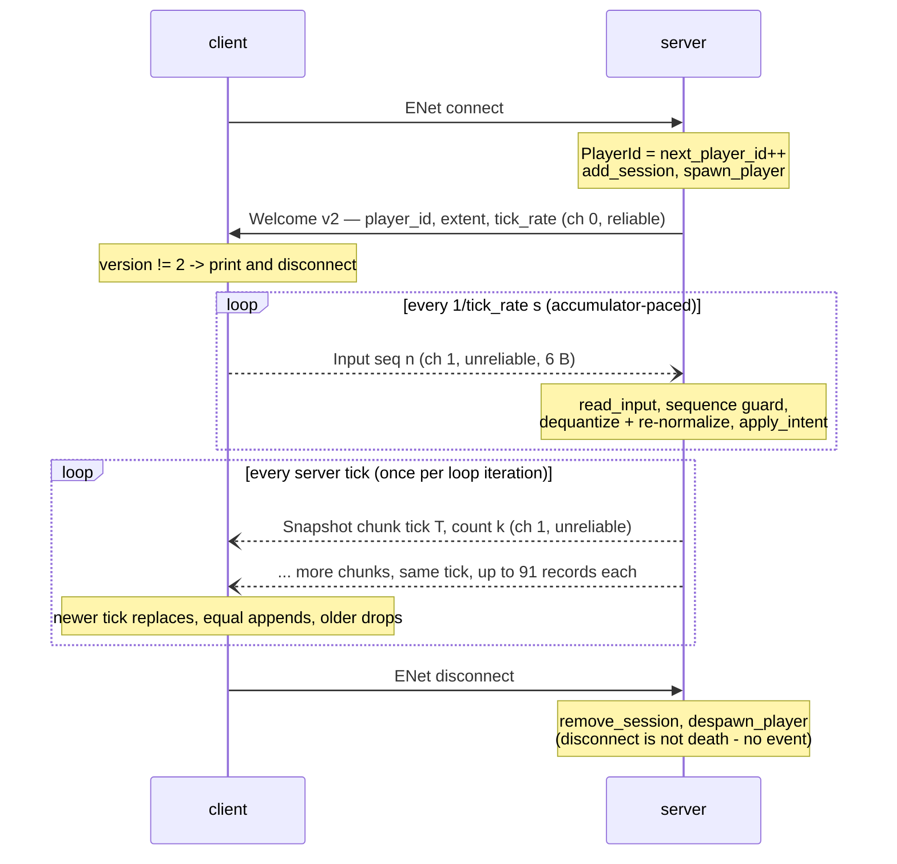

# Protocol

The wire format, byte for byte: five message ids over two ENet channels, all integers
**little-endian**, all packing rules in exactly two files —
[`core/include/blob/net/protocol.hpp`](../core/include/blob/net/protocol.hpp) (+
[`protocol.cpp`](../core/src/net/protocol.cpp)) for message layout and
[`core/include/blob/net/quantize.hpp`](../core/include/blob/net/quantize.hpp) for
float↔wire conversion — shared verbatim by client and server, so a second definition of
the format cannot exist.

## Version policy

`protocol_version` is currently **2** (2: the M1 snapshot family). Any packing change —
field added, width changed, encoding changed, `EntityKind` extended — bumps it; wire
changes within one iteration batch into a single bump. The test
`Snapshot.ProtocolVersionPinnedAtTwo` re-pins the literal so an accidental format change
fails loudly and a deliberate one is re-pinned consciously.

The check is **one-way today**: Welcome carries the server's version, and the *client*
refuses on mismatch (prints both versions, disconnects). The server cannot refuse a
too-old client yet because the client sends no version — symmetric refusal arrives with
M6's Hello payload. (Beware the comment in `protocol.hpp` that says both sides refuse:
the code is client-side only.)

## Channels

| Channel | Value | ENet mode | Carries | Why |
|---|---|---|---|---|
| `Control` | 0 | reliable, ordered (`ENET_PACKET_FLAG_RELIABLE`) | Welcome (M6: Hello, Goodbye) | session state must arrive, in order |
| `Snapshot` | 1 | unreliable sequenced (flags 0) | Snapshot chunks **and** Input | the 20 Hz firehose — a dropped snapshot is always better than a late one (invariant 5) |

Invariant 5's rationale: a snapshot is absolute state that the next tick supersedes, so
retransmitting a lost one delivers stale data late and delays everything behind it.
**Input rides the unreliable channel for the same reason** — it is a latest-wins stream (a
lost input is outdated by the next one, 50 ms later) and the u16 sequence guard
([below](#the-sequence-guard)) makes reordering harmless. Reliability would only add
head-of-line blocking to data whose value expires faster than a retransmit.

Flags 0 in ENet means **unreliable sequenced**: within the channel, a packet that arrives
after a later-sent one is dropped by ENet itself. For snapshot chunks that is exactly
right — a tick-T chunk arriving after a tick-T+1 chunk is already superseded — and the
client's own latest-tick guard makes the same call one layer up.

## Message catalog

| Id | Byte | Direction | Size | Codec |
|---|---|---|---|---|
| `Hello` | `0x01` | client → server | — | declared; no codec until M6 |
| `Input` | `0x02` | client → server | 6 B | `write_input` / `read_input` |
| `Welcome` | `0x81` | server → client | 8 B | `write_welcome` / `read_welcome` |
| `Snapshot` | `0x82` | server → client | 7 + n·13 B | `write_snapshot` / `read_snapshot` |
| `Goodbye` | `0x83` | server → client | — | declared; no codec until M6 |

### Input — 6 bytes

| Offset | Field | Type | Encoding |
|---|---|---|---|
| 0 | message id | u8 | `0x02` |
| 1 | `sequence` | u16 | wrapping serial, client-incremented per send |
| 3 | `dir_x` | i8 | `quantize_direction` of a unit vector's x |
| 4 | `dir_y` | i8 | `quantize_direction` |
| 5 | flags | u8 | bit 0 = `split`, bit 1 = `eject`, rest ignored |

### Welcome — 8 bytes

| Offset | Field | Type | Encoding |
|---|---|---|---|
| 0 | message id | u8 | `0x81` |
| 1 | `version` | u16 | `protocol_version`; client refuses on mismatch |
| 3 | `player_id` | u16 | never 0 |
| 5 | `world_extent` | u16 | whole world units; the client's dequantization denominator |
| 7 | `tick_rate` | u8 | Hz; the client's input-send cadence |

The config validator pins these widths at the source: `tick_rate` must sit in [1, 255]
and `world_extent` in (0, 65535] or the server refuses to start — anything else would
silently truncate here.

### Snapshot chunk — 7 + n·13 bytes

Header, 7 B:

| Offset | Field | Type | Encoding |
|---|---|---|---|
| 0 | message id | u8 | `0x82` |
| 1 | `tick` | u32 | the u64 sim tick truncated — 2³² ticks at 20 Hz ≈ **6.8 years** of uptime before wrap, fine |
| 5 | `count` | u16 | records in **this chunk** (≤ 91), not in the world |

Then `count` × `EntityRecord`, 13 B each:

| Offset | Field | Type | Encoding |
|---|---|---|---|
| +0 | `id` | u32 | `EntityId` (never 0) |
| +4 | `owner` | u16 | `PlayerId`, 0 = unowned |
| +6 | `kind` | u8 | `EntityKind` mirror; must be < 4 |
| +7 | `x` | u16 | `quantize_position(x, extent)` |
| +9 | `y` | u16 | `quantize_position(y, extent)` |
| +11 | `mass` | u16 | `quantize_mass` — linear whole units, saturating |

Byte order is a wire-format promise, pinned before a second implementation exists:
`Protocol.WideWritesAreLittleEndianOnTheWire` asserts `write_u32(0x11223344)` lands as
`44 33 22 11`.

## Chunking

A pellet field is far bigger than one datagram, so chunking exists from day one:

```
snapshot_soft_mtu        = 1200 B         (comfortably under the common 1500 B path MTU,
                                           with room for IP/UDP/ENet framing — a chunk
                                           never fragments)
max_entities_per_chunk   = (1200 − 7) / 13 = 91      (1193 / 13 = 91.77, floored)

full chunk               = 7 + 91·13 = 1190 ≤ 1200   ✓
one more record          = 7 + 92·13 = 1203 > 1200   ✗
```

Both edges are pinned in `Snapshot.ChunkArithmeticFitsTheMtuBudget`. The shipped slicing is
`for_each_chunk` in [`server/src/snapshot_encode.hpp`](../server/src/snapshot_encode.hpp):
subspans of ≤ 91 in array order — 200 records make chunks of 91 + 91 + 18 — and **zero
records make zero chunks** (an empty world is not worth a datagram, though a 7-byte empty
chunk is perfectly legal at the codec level and `Snapshot.EmptySnapshotIsLegalAndExactlySevenBytes`
proves it).

**Every chunk is self-contained**: it repeats the tick and carries its own count, so no
chunk depends on any other. The client's assembly rule (`apply_chunk`, mirrored exactly in
the loopback test) is latest-tick-wins:

- chunk tick **newer** than the view → *replace* the entity set, adopt the tick;
- chunk tick **equal** → *append* (another chunk of the same snapshot);
- chunk tick **older** → *drop* (it lost the race; the newer state already superseded it).

Losing a chunk is benign **because records are absolute state**: partial application just
means some entities are missing from one frame and pop back with the next snapshot, 50 ms
later. There is no delta to corrupt — that trade changes when M6 introduces delta
snapshots, which is why acks (`InputCommand::sequence`) are being laid down now.

## Robustness contract

Readers return `std::nullopt` on **any** malformation, writers set a sticky `overflowed`
flag and never write past the buffer; neither ever throws (invariant 7). The cases, each
pinned by a test in [`core/tests/test_snapshot.cpp`](../core/tests/test_snapshot.cpp) /
[`test_quantize.cpp`](../core/tests/test_quantize.cpp):

| Malformation | Result | Test |
|---|---|---|
| wrong message-id byte | nullopt | `Snapshot.WrongMessageIdIsRejected` |
| truncation anywhere — all 46 proper prefixes of a 3-record chunk | nullopt | `Snapshot.EveryTruncationIsRejectedNotGuessed` |
| garbage kind (≥ 4) | nullopt | `Snapshot.OutOfRangeKindIsRejected` |
| count claiming records the bytes don't contain | nullopt | `Snapshot.CountLyingBeyondTheBytesIsRejected` |
| count > 91, even with the records genuinely present | nullopt | `Snapshot.CountAboveChunkLimitIsRejected` |
| count > caller's `out` span | nullopt — reject, never spill | `Snapshot.UndersizedOutSpanIsRejected` |
| writer out of room | flag; a straddling write lands what fits, nothing past the end | `Snapshot.WriterOverflowSetsFlagInsteadOfScribbling` |
| `write_snapshot` span > 91 records | **flagged misuse, nothing written at all** — the check runs before the first byte | `Snapshot.OversizedSpanIsFlaggedMisuseNotAScribble` |
| corrupted public cursor (`offset` = SIZE_MAX) | flag, no wrap, no stray access | `Protocol.MaximalOffsetCannotWrapPastTheBoundsCheck` |

On success, `read_snapshot` fills the first `count` entries of `out` and returns the
header. The `offset >= size` bounds-check idiom that makes the last row work is explained
in [data-structures.md](data-structures.md#bytewriter--bytereader). The server's stance on
a rejected packet is *drop and move on* — malformed wire data is never fatal.

## Quantization

The snapshot stream is the bandwidth bill — every entity × 20 Hz × every peer — so every
field crossing the wire is quantized, and **wire values are display-only**: the server
keeps the authoritative floats and resolves all gameplay against them, so quantization
error is a rendering concern, never a correctness one. (The README's
[Quantization section](../README.md#quantization) tells the same story with the full
mass-encoding rationale.)

| Field | Encoding | Step | Worst error (round-to-nearest = half a step) |
|---|---|---|---|
| position | u16 per axis: `round(clamp(v/extent, 0, 1) · 65535)` | extent/65535 ≈ **0.125 units** at 8192 | extent/65535/2 ≈ **0.0625 units** |
| direction | i8 per axis: `round(clamp(v, −1, 1) · 127)` | 1/127 ≈ 0.0079 | ≈ 0.39 % per axis |
| mass | u16: `round(clamp(m, 0, 65535))` | 1 unit | **0.5 units** |

Worked example, position: `x = 123.456` at extent 8192 → `123.456/8192 · 65535 + 0.5` →
code `988` → decodes to `988/65535 · 8192 ≈ 123.502`, error ≈ 0.046 < 0.0625. Out-of-range
values clamp, never wrap (`Quantize.ValuesAreClampedNotWrapped`); the end-to-end bound —
through `write_snapshot`/`read_snapshot` with the real quantizers — is pinned by
`Snapshot.QuantizedFieldsStayWithinErrorBounds`.

**Why 8 bits suffice for direction**: it encodes a unit vector's components for a server
that re-normalizes on receipt and clamps speed by mass anyway — sub-degree steering
precision would be spent on nothing. `quantize_direction` rounds away from zero and so
never produces −128; `dequantize_direction` clamps `q/127` into [−1, 1], so a hostile
−128 decodes to −1.0 rather than −1.008.

**Why mass is linear** rather than the byte-ranged `√mass` a bandwidth purist would reach
for: drawn radius is `r = k·√m`, so packing `√m` gives uniform steps in *radius* — but its
representable masses are roughly the perfect squares (1, 4, 9, 16, 25…), which destroys
exactly the small end that must be exact: a HUD score decoded from them jumps visibly and
pellet masses collapse onto a couple of codes. Linear u16 keeps every mass the game
currently produces exact on the wire (±0.5) and saturates at 65 535. If per-entity bytes
ever become the *measured* bottleneck: per-kind records first (pellets need neither `mass`
nor `owner`), √mass second — either bumps `protocol_version`.

## The sequence guard

The input stream is unreliable *and* unordered, so the server applies an Input only if its
sequence is strictly newer than the last applied one — serial-number arithmetic on the u16
circle ([`server/src/session.hpp`](../server/src/session.hpp)):

```cpp
sequence_newer(a, b)  =  int16_t(uint16_t(a − b)) > 0
```

The subtraction is exact mod 2¹⁶; reinterpreting it as signed asks "is `a` less than half
the circle ahead of `b`?". Edge cases, all pinned in
[`server/tests/test_session.cpp`](../server/tests/test_session.cpp):

| a | b | `a − b` (mod 2¹⁶) | as i16 | newer? |
|---|---|---|---|---|
| 1 | 0 | 1 | +1 | yes |
| 0 | 1 | 65535 | −1 | no |
| 0 | 65535 | 1 | +1 | **yes — the wrap case**: 0 follows 65535, a long session never freezes |
| 65535 | 65535 | 0 | 0 | no — equal is never newer, a duplicated datagram must not re-apply |
| 32767 | 0 | 32767 | +32767 | yes — the farthest "newer" |
| 32768 | 0 | 32768 | −32768 | **no** — exactly half the circle apart is ambiguous by construction and lands on "not newer" both ways: the safe side for an input guard |

## Session flow



The whole chain — connect → Welcome → Input → `apply_intent` → `step` → chunked broadcast →
client decode, over a real UDP socket on 127.0.0.1 — is exercised end-to-end by
`Loopback.CursorChaseOverRealUdp` in
[`server/tests/test_loopback.cpp`](../server/tests/test_loopback.cpp).
